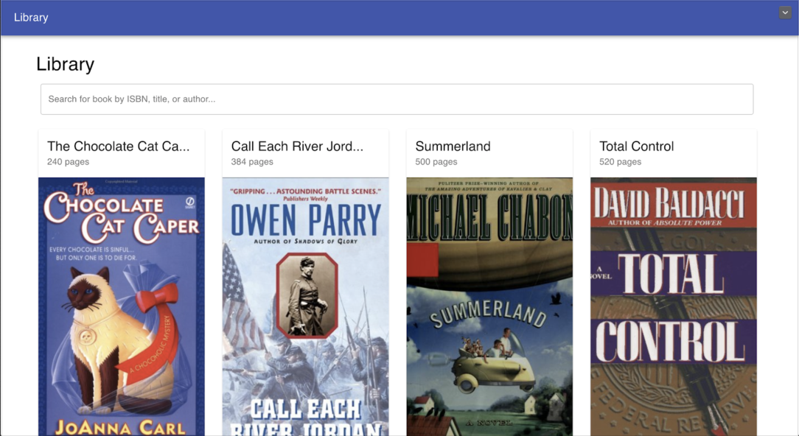

<!----- Conversion time: 0.792 seconds.

Using this HTML file:

1. Cut and paste this output into your source file.
2. See the notes and action items below regarding this conversion run.
3. Check the rendered output (headings, lists, code blocks, tables) for proper
   formatting and use a linkchecker before you publish this page.

Conversion notes:

* Docs to Markdown version 1.0β17
* Thu Nov 21 2019 08:57:57 GMT-0800 (PST)
* Source doc: https://docs.google.com/open?id=1fDWfemvHYExGDWp06AQ2fj4F9c1WQii9w6piAEAhD28
* This document has images: check for >>>>>  gd2md-html alert:  inline image link in generated source and store images to your server.
----->

<h3>Project File Install:</h3>

<ol>

<li>Included in the turned in folder

<li>Alternatively, clone from <a href="https://github.com/Team-Silver/Database-Project.git">https://github.com/Team-Silver/Database-Project.git</a>
</li>
</ol>
<h3>Database Setup:</h3>

<ol>

<li>Setup MySQL server

<li>Setup MySQL Workbench (<a href="https://dev.mysql.com/downloads/workbench/">https://dev.mysql.com/downloads/workbench/</a>)

<li>Run the included LibraryDump(checkpoint1).sql file in MySQL Workbench

<li>Alternatively, run the included normalize-insert.py and insert your credentials

<li>Make sure to run all of these commands on localhost, under user ‘root’, with password ‘password’
</li>
</ol>

<pre class="prettyprint">The backend was written in node. Node allows you to run javascript on the server side. It uses a package called mysql to connect to the local mysql database and make queries. It uses a package called express for routing. It also uses a few other packages to allow for cross-origin resource sharing and date formatting.</pre>

<h3>Backend Setup:</h3>

<ol>

<li>Download and install node and the node package manager: <a href="https://nodejs.org/en/download/">https://nodejs.org/en/download/</a>

<li>Navigate into the directory called `liams-backend`.

<li>Run the command `npm install` in the directory `liams-backend`.  This will install all the dependencies for the project.

<li>To run the backend, start the server, and connect the server to the database, run the command `node index.js`

<li>You should get a couple of messages at this point: 
<ol>
 
<li>“Example app listening on port 3000!”
 
<li>“Connected!”
</li> 
</ol>

<li>If you get these two messages, the app is ready to run.
</li>
</ol>

<pre class="prettyprint">The frontend was written in react. React is a frontend development framework for building user interfaces. It gets data from the backend through REST API calls. It also uses a styling library called material UI that allows has prebuilt UI components, much like bootstrap. It uses a few other packages for routing, date formatting, alerts, and state management.</pre>

<h3>Frontend Setup:</h3>

<ol>

<li>Make sure that you still have node installed from the backend setup.

<li>Navigate into the directory called `db-frontend`.

<li>Run the command `npm install` in the directory `db-frontend`. This will install all the dependencies for the project.

<li>After the install is complete, run the command ‘npm start’ which will run the frontend server and automatically open it in a new tab.

<li>If it does not open automatically, navigate to `<a href="http://localhost:3001">http://localhost:3001/books</a>` in your browser.

<li>You should see a screen similar to this with a random assortment of books

    

</li>
</ol>
